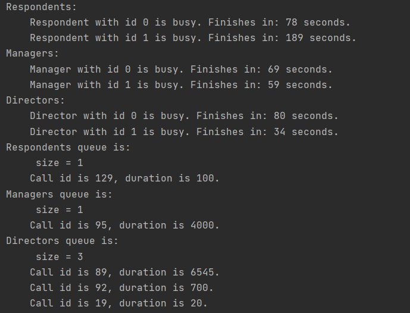

# Call Center
## Strategy to implement
I considered lots of strategies, the main were: using java core (not multi-threading approach), using spring boot 
and save everything in a database and use core multithreading approach. 
The first approach can implement the task while processing a call in a time, which I did not want. Also, I could not 
then "block" employee by system.
Second doesn't represent a real-world problem, as system would ask database each time for free employees. This is 
a) costly b) doesn't make sense as telephone lines do not work as a database.
Multithreading approach was chosen to imitate streaming system. With such approach multiple employees handle calls,
and each employee is blocked when he/she answers a call.

## Models
1. Abstract employee class: all employees extend that class having name (for simplicity here - id) and
   status (free or not). Each employee can handle a call. They also keep track of a current call.
2. Respondent, Manager and Director: 3 types of employee. 
3. Call: has an id, rank (0 - for respondent, 1 - manager, 2 - director) and duration of a call. In this application rank
   is generated randomly (to imitate the system where people are calling different employees). Duration is used for the
   time when employee is blocked (whole duration of a call). Call also has start time, when the call is processed.
4. CallHandler: connects an employee with a call. This entity implements Runnable  and processes call (sets status of 
   employee to busy, blocks employee from answering other calls, sets status back to free and polls queue).  
   
GetEmployeeTypeFactory was made to differentiate between employees (factory design pattern).

## Where magic happens
CallCenter: 
I have 3 lists of employees: one for each type. User decides how many employees are working now.
After filling the lists, you can call. Employee will handle the call based on the rank of a question. 
Handling goes such way: 
If rank is 0, respondent will pick the call. If respondents are busy, manager will handle the call. If manager is busy,
director will handle the call. If all of them are busy, the call will be placed back to respondents queue and be handled
as soon as possible.
When all queues are empty, user will get a message. User will also get a message when employee finished handling call
and when polling queue started.

## Bonus
User can check current statistics of a system : it will indicate available employees of each type as well as busy 
employees and corresponding amount of time left. It will also show status of each queue. This is done to understand how much time you will have to wait.

